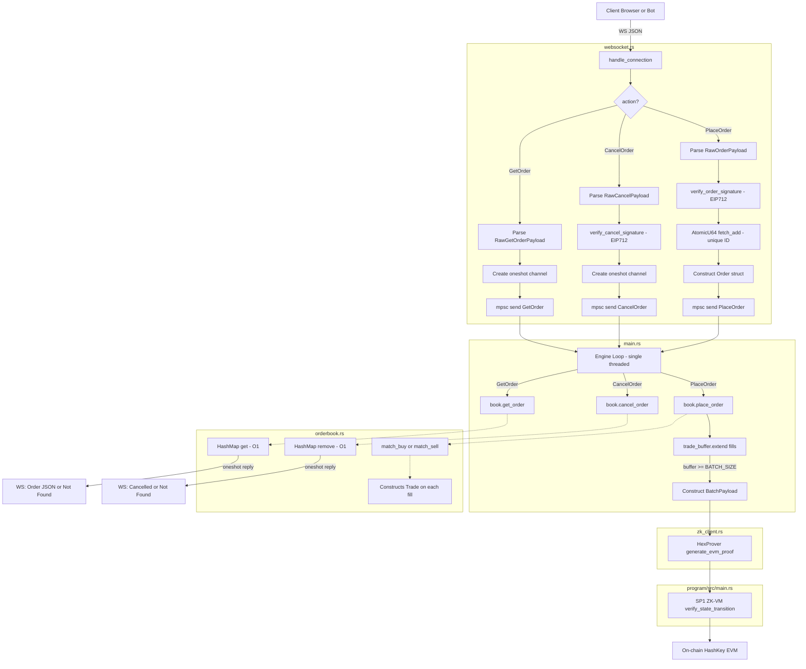

HEX(Hash-DEX) is a decentralised CLOB on Hash key chain(optimistic rollup)


## The Full Pipeline: Life of an Order

Here is the exact path an order takes through the entire system, step by step.



### Step-by-Step Walkthrough

#### Step 1: Client sends a WebSocket message
The client (browser, trading bot, etc.) connects to `ws://0.0.0.0:3000/ws` and sends a JSON message:
```json
{
  "action": "PlaceOrder",
  "payload": {
    "user_address": "0xAbC123...",
    "price": 100,
    "amount": 5,
    "is_buy": true,
    "signature": "0x1a2b3c..."
  }
}
```

