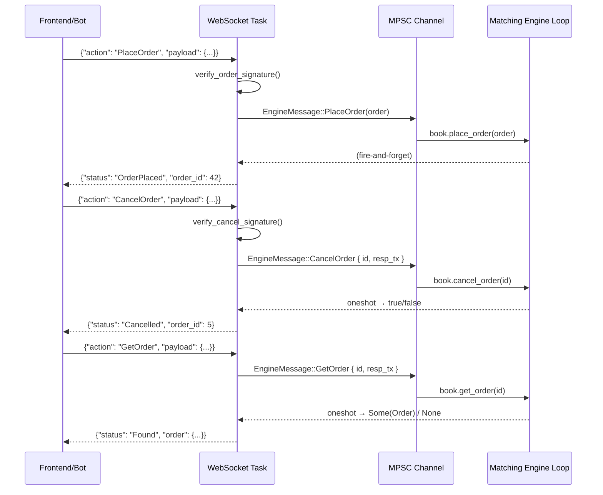

HEX(Hash-DEX) is a decentralised CLOB on Hash key chain(optimistic rollup)
# Walkthrough: Action-Based WebSocket Routing

## Overview

We integrated `cancel_order` and `get_order` into the live WebSocket pipeline, eliminating all OrderBook dead-code warnings and establishing a structured message-routing architecture across 3 files.

## Files Changed

- [orderbook.rs](file:///Users/avinash/Desktop/projects/hex_protocol/sequencer/src/engine/orderbook.rs) — Added `EngineMessage` enum, removed `#[allow(dead_code)]`
- [main.rs](file:///Users/avinash/Desktop/projects/hex_protocol/sequencer/src/main.rs) — Switched channel type, added match-based routing
- [websocket.rs](file:///Users/avinash/Desktop/projects/hex_protocol/sequencer/src/rpc/websocket.rs) — Full rewrite with action-based JSON routing

---

## How It Works

### The New Pipeline



### PlaceOrder (unchanged logic, new envelope)
1. Client sends `{"action": "PlaceOrder", "payload": { user_address, price, amount, is_buy, signature }}`.
2. The WebSocket task verifies the EIP-712 signature (unchanged crypto pipeline).
3. The atomic counter generates a unique ID.
4. An `EngineMessage::PlaceOrder(order)` is pushed into the MPSC channel.
5. The engine loop calls `book.place_order()` — **fire-and-forget**, no response channel needed.
6. Client gets `{"status": "OrderPlaced", "order_id": N}`.

### CancelOrder (new)
1. Client sends `{"action": "CancelOrder", "payload": { user_address, order_id, signature }}`.
2. The WebSocket task verifies a **new** `Eip712CancelPayload` signature (hashes the `order_id` instead of trade data).
3. A `tokio::oneshot::channel` is created — this is the return line.
4. `EngineMessage::CancelOrder { id, response_tx }` is pushed into the MPSC channel.
5. The engine loop calls `book.cancel_order(id)`, checks if it returned `Some`, and sends `true`/`false` back over the oneshot.
6. The WebSocket task `await`s the oneshot result and replies to the client with `{"status": "Cancelled"}` or `{"error": "Order not found"}`.

### GetOrder (new)
1. Client sends `{"action": "GetOrder", "payload": { order_id }}`.
2. **No signature required** — this is a public read-only query.
3. A `oneshot::channel` is created.
4. `EngineMessage::GetOrder { id, response_tx }` is pushed into the MPSC.
5. The engine loop calls `book.get_order(id).cloned()` and sends the result back.
6. The WebSocket task formats the full order as JSON and replies.

> [!IMPORTANT]
> The core design principle is preserved: the OrderBook is **never** touched from multiple threads. Every operation still flows through the single-threaded MPSC consumer loop. The `oneshot` channels only carry *results* back — they don't give external code access to the OrderBook.

---

## New Client JSON Format

All WebSocket messages must now be wrapped in an `action` envelope:

```json
// Place Order
{"action": "PlaceOrder", "payload": {"user_address": "0x...", "price": 100, "amount": 5, "is_buy": true, "signature": "0x..."}}

// Cancel Order
{"action": "CancelOrder", "payload": {"user_address": "0x...", "order_id": 42, "signature": "0x..."}}

// Get Order (no signature)
{"action": "GetOrder", "payload": {"order_id": 42}}
```

## Validation

- `cargo check` passes with **zero errors** and **zero warnings from `orderbook.rs`**.
- The only remaining warnings are from `zk_client.rs` (the ZK prover module — a separate integration task).
